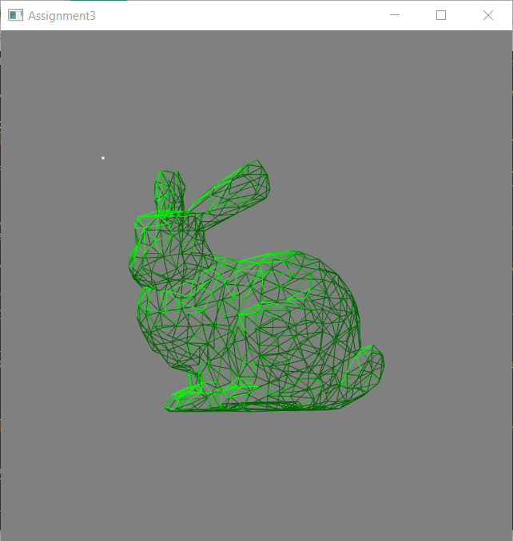

# CS-GY 6533 A – Interactive Computer Graphics - Fall 2021

### Assignment 3

*Yangfan Zhou*

<yz8338@nyu.edu>

# Implementation & Result

## Scene Editor

* Insertion (1 2 3)

(1) Cube: the insertion of the unit cube is implemented in importCube() function. Everytime when user pressed the key '1', this function will be called once. It generally create new VAO, VBO and two other vertexBufferObject which I used for its plane normals and vertex normals. Then it stores all vertex positions following the order of each triangle and calculate plane normals for each triangle simultaneously. After storing all vertex position information, calculate each vertex's normal by averaging its neighboring plane normals and store them in vNBO. Finally, create a model matrix for this cube object and store it in 'model' vector. Similarly, push back 'w' into 'renderMode' vector for this cube object.

(2) bumpy_cube.off: the insertion of bumpy_cube.off object is implemented by importOff() function. Everytime when user pressed key '2', this function together with the file name will be called once. Similarly to assignment 1, we use getline to read in the file and store all the position vertex. Then I loop all the vertexes to find every axis's min and max value, average them, and apply them to all the vertex to center them on the origin. After that, I find the max value of all the coordinates and divide 0.5f by it to scale the object to exactly fit in unit cube. The normals are similar to be derived as described before.

(3) bunny.off: similar to (2).




* Delete (backspace)

* Light source

## Object Control

* Selection (mouseclick)

* Translate (w a s d)

* Rotate (h j)

* Rescale (k l)

* Change render mode (i o p)

## Camera Control

* Orthographic camera (z)

* Perspective camera (x)

* Camera move (up down right left)


# Compilation Instructions

```bash
cd Assignment_2
mkdir build
cd build
cmake ../ # re-run cmake when you add/delete source files
make # use "cmake --build ." for Windows
```
