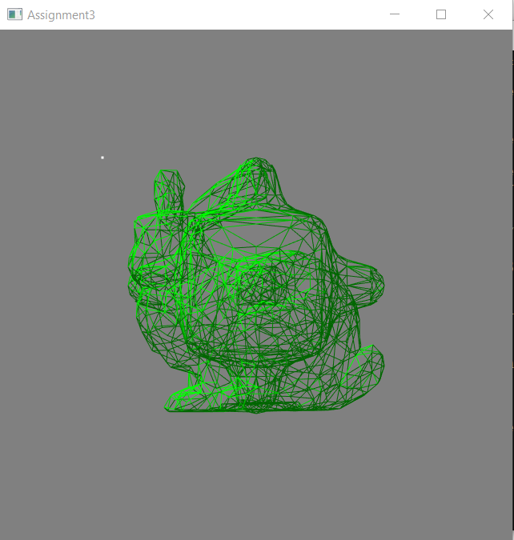
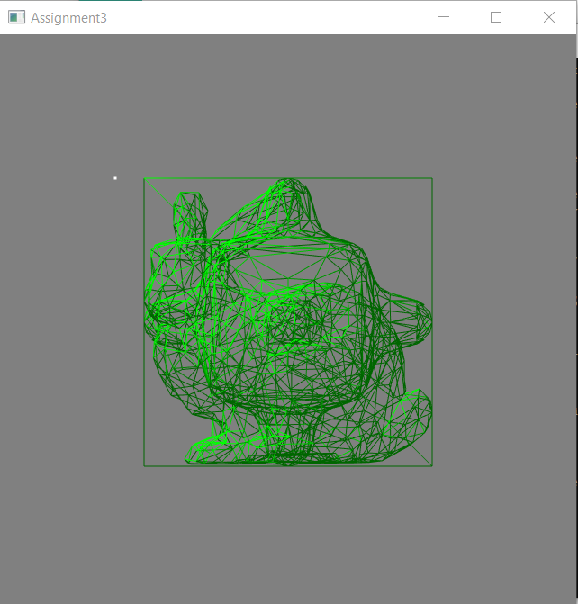
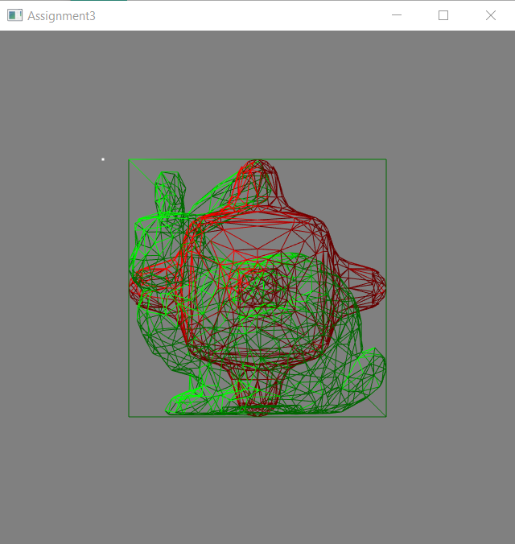
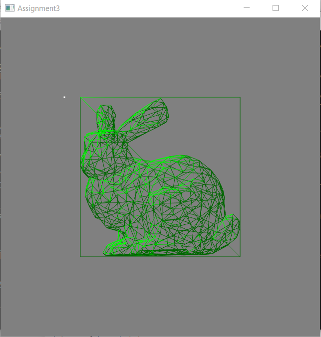
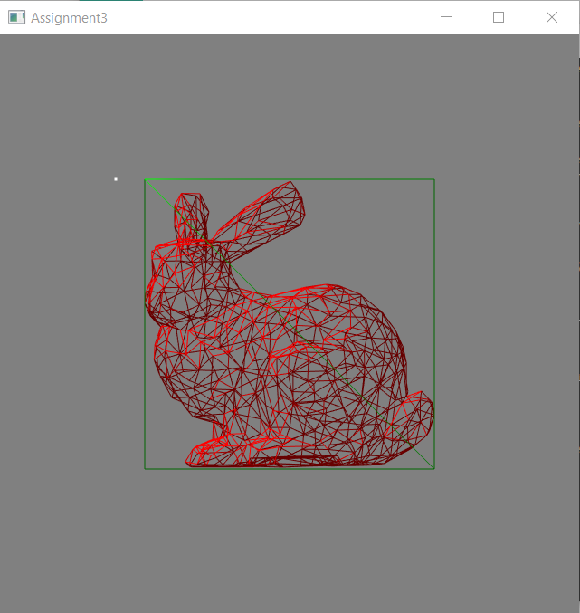

# CS-GY 6533 A – Interactive Computer Graphics - Fall 2021

### Assignment 3

*Yangfan Zhou*

<yz8338@nyu.edu>

# Implementation & Result

## Scene Editor

* Insertion (1 2 3)

(1) Cube: the insertion of the unit cube is implemented in importCube() function. Everytime when user pressed the key '1', this function will be called once. It generally create new VAO, VBO and two other vertexBufferObject which I used for its plane normals and vertex normals. Then it stores all vertex positions following the order of each triangle and calculate plane normals for each triangle simultaneously. After storing all vertex position information, calculate each vertex's normal by averaging its neighboring plane normals and store them in vNBO. Finally, create a model matrix for this cube object and store it in 'model' vector. Similarly, push back 'w' into 'renderMode' vector for this cube object.

(2) bumpy_cube.off: the insertion of bumpy_cube.off object is implemented by importOff() function. Everytime when user pressed key '2', this function together with the file name will be called once. Similarly to assignment 1, we use getline to read in the file and store all the position vertex. Then I loop all the vertexes to find every axis's min and max value, average them, and apply them to all the vertex to center them on the origin. After that, I find the max value of all the coordinates and divide 0.5f by it to scale the object to exactly fit in unit cube. The normals are similar to be derived as described before.

(3) bunny.off: similar to (2).


Insert bunny



Insert bumpy



Insert cube

* Delete (backspace)

In order to delete an object, the user need to first select it and then press backspace. The selection will be described in the Object Control section. When an object is selected, it will update the 'index' global variable. Then we use it to delete corresponding vector in all the VBO and VAO. The selected object can be deleted.

e.g.



Select bumpy



Delete bumpy

* Light source

I use specialized shaders light_vertex_shader and light_fragment_shader, bind them with lightVBO and draw the point light at the beginning of the render loop. The light position is stored at global variable 'lightPosition'. Here I set the position at (-0.6, 0.5, 0.4) as shown in the pictures.

```bash
const GLchar* light_vertex_shader =
        "#version 150 core\n"
                "in vec3 position;"
                "uniform mat4 model;"
                "uniform mat4 view;"
                "uniform mat4 projection;"
                "void main()"
                "{"
                "    gl_Position = projection * view * model * vec4(position, 1.0);"
                "}";
const GLchar* light_fragment_shader =
        "#version 150 core\n"
                "out vec4 lightColor;"
                "void main()"
                "{"
                "    lightColor = vec4(1.0);"
                "}";
```

In order to render the objects with light, I change the objects' vertex shader and fragment shader like the following. For multiple object, just using stencil buffer and change the combination of position, normal and m-v-p matrix with the program each time.

```bash
const GLchar* vertex_shader =
            "#version 150 core\n"
                    "in vec3 position;"
                    "in vec3 normal;"
                    "out vec3 FragPos;"
                    "out vec3 Normal;"
                    "uniform mat4 model;"
                    "uniform mat4 view;"
                    "uniform mat4 projection;"
                    "void main()"
                    "{"
                    "    FragPos = vec3(model * vec4(position, 1.0));"
                    "    Normal = mat3(transpose(inverse(model))) * normal;"
                    "    gl_Position = projection * view * model * vec4(position, 1.0);"
                    "}";
    const GLchar* fragment_shader =
            "#version 150 core\n"
                    "out vec4 outColor;"
                    "in vec3 Normal;"
                    "in vec3 FragPos;"
                    "uniform vec3 lightPos;"
                    "uniform vec3 viewPos;"
                    "uniform vec3 lightColor;"
                    "uniform vec3 objectColor;"
                    "void main()"
                    "{"
                    "    float ambientStrength = 0.4;"
                    "    vec3 ambient = ambientStrength * lightColor;"
                    "    vec3 norm = normalize(Normal);"
                    "    vec3 lightDir = normalize(lightPos - FragPos);"
                    "    float diff = max(dot(norm, lightDir), 0.0);"
                    "    vec3 diffuse = diff * lightColor;"
                    "    float specularStrength = 0.5;"
                    "    vec3 viewDir = normalize(viewPos - FragPos);"
                    "    vec3 reflectDir = reflect(-lightDir, norm);"
                    "    float spec = pow(max(dot(viewDir, reflectDir), 0.0), 16);"
                    "    vec3 specular = specularStrength * spec * lightColor;"
                    "    vec3 result = (ambient + diffuse + specular) * objectColor;"
                    "    outColor = vec4(result, 1.0);"
                    "}";
```

## Object Control

* Selection (mouseclick)

The object selection is implemented by using glReadPixels and stencil buffer. When mouseclick event is active, we use glReadPixel to read in the stencil index for the current pixel and store it in global variable 'index'.
```bash
void mouse_button_callback(GLFWwindow* window, int button, int action, int mods)
{
    if (action != GLFW_PRESS)
        return;

    // Get the position of the mouse in the window
    double x, y;
    glfwGetCursorPos(window, &x, &y);

    // Get the size of the window
    int width, height;
    glfwGetWindowSize(window, &width, &height);
    
    // Read pixel
    glReadPixels(x, height - y - 1, 1, 1, GL_RGBA, GL_UNSIGNED_BYTE, color);
    glReadPixels(x, height - y - 1, 1, 1, GL_DEPTH_COMPONENT, GL_FLOAT, &depth);
    glReadPixels(x, height - y - 1, 1, 1, GL_STENCIL_INDEX, GL_UNSIGNED_INT, &index);

    printf("Clicked on pixel %f, %f, color %02hhx%02hhx%02hhx%02hhx, depth %f, stencil index %u\n",
    x, y, color[0], color[1], color[2], color[3], depth, index);
}
```
We use 'index' to operate selected object in the render loop. First, enable stencil test before drawing each object. Then I use a for loop to draw all object in VAO vector. For each drawing, increase the stencil index. We use this stencil index to compare with the selected 'index'. If the object is selected, we set the object color to red. Else, the object color is green.

e.g. bunny is selected



For each object's transformation, I use 'model' vector to store their model matrix. They are initialized and push backed when the object is imported. And if the object is selected, change corresponding model matrix in 'model' vector (in key_callback function). When rendering, just bind corresponding model matrix to the shader for each object.

* Translate (w a s d)


* Rotate (h j)

H - rotate counter-clockwise (from object's perspective)

J - rotate clockwise (from object's perspective)


* Rescale (k l)

K - scale down

L - scale up


* Change render mode (i o p)

Similarly to model matrix, I use 'renderMode' vector to store and change each object's render mode. The default mode is wireframe mode. And each selected object's mode can be changed when user pressed 'i', 'o', 'p' keys for wireframe, flat shading and phong shading.


For wireframe mode, for each object in the scene, we combine their VBO and NBO (normal buffer) to the program and draw triangle lines.

For flat shading, use plane normals and draw triangles with lines.

For phong shading, change the plane normals to vertex normal (derived when importing). Then draw triangles.

```bash
// Render
int cols = VBOs[i].cols;
if (renderMode[i] == 'w') {
    for (int i = 0; i < cols; i += 3) {
        glDrawArrays(GL_LINE_STRIP, i, 3);
    }
} else if (renderMode[i] == 'f') {
    for (int i = 0; i < cols; i += 3) {
        glUniform3f(program.uniform("objectColor"), 1.0f, 0.5f, 0.31f);
        glDrawArrays(GL_TRIANGLES, i, 3);
        glUniform3f(program.uniform("objectColor"), 0.0f, 0.0f, 0.0f);
        glDrawArrays(GL_LINE_STRIP, i, 3);
    }
} else if (renderMode[i] == 'p') {
    program.bindVertexAttribArray("normal", vNBOs[i]);
    for (int i = 0; i < cols; i += 3) {
        glDrawArrays(GL_TRIANGLES, i, 3);
    }
}
```

## Camera Control

* Camera move (up down right left)

The camera control is implemented by the following view matrix.

```bash
view = glm::lookAt(cameraPos, glm::vec3(0.0, 0.0, 0.0), glm::vec3(0.0, 1.0, 0.0));
```

By changing cameraPos everytime user press 'w-a-s-d' in key_callback function, we can derive different view.
By setting the second parameter fixed at (0.0, 0.0, 0.0), we can make sure that the camera is always looking at the origin.

As for projection, I use 'perspective' variable to differentiate the two modes of projections. In order to adapt the resize of window, I calculate the aspect ratio everytime in the render loop and apply it to projection matrix directly.

```bash
if(perspective) {
    projection = glm::perspective(glm::radians(45.0f), 1/aspect_ratio, 0.5f, 150.f);
} else {
    projection = glm::ortho(-1.0f, 1.0f, -1.0f * aspect_ratio, 1.0f * aspect_ratio, -10.0f, 10.0f);
}
```

* Orthographic camera (z)


* Perspective camera (x)


# Compilation Instructions

```bash
cd Assignment_2
mkdir build
cd build
cmake ../ # re-run cmake when you add/delete source files
make # use "cmake --build ." for Windows
```
